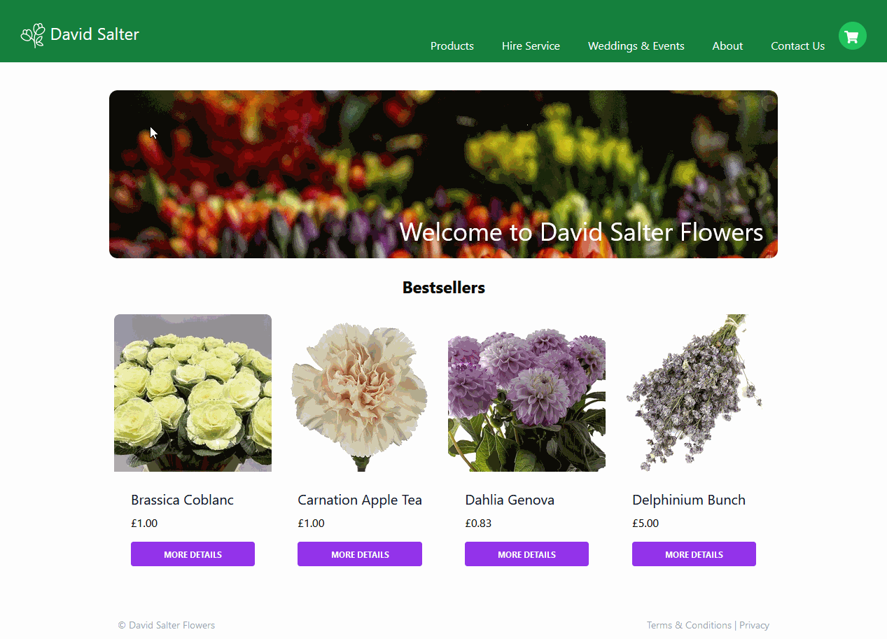

# Headless Shopify Example Store

This is an example ecommerce store to show how NextJS can be used to build a headless front-end and use Shopify for the back-end.

## Live site

The site can be found online at [https://nextjs-headless-shopify-beta.vercel.app/](https://nextjs-headless-shopify-beta.vercel.app/)

## Tech used

* Shopify
* NextJS
* TailwindCSS
* GraphQL

## Features wishlist

* Filtering and sorting on the category pages
* A build process triggered whenever a product or page is created in Shopify
